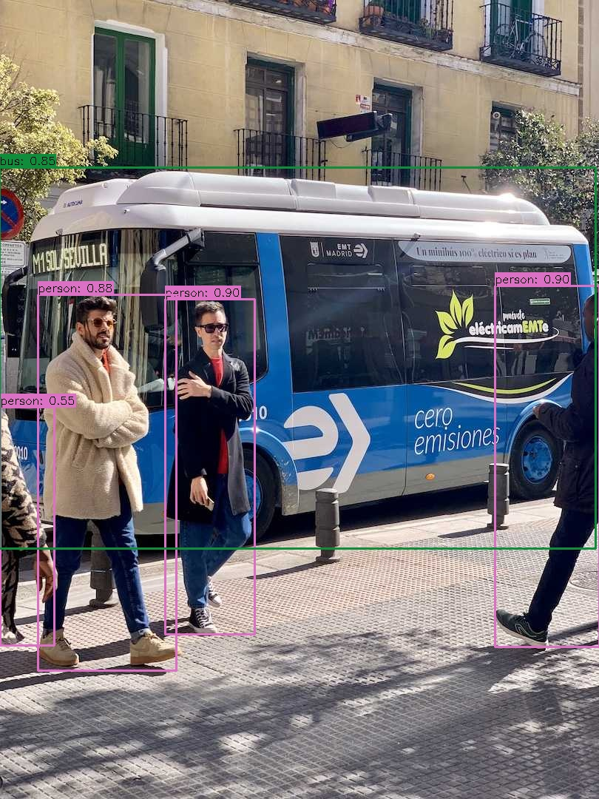
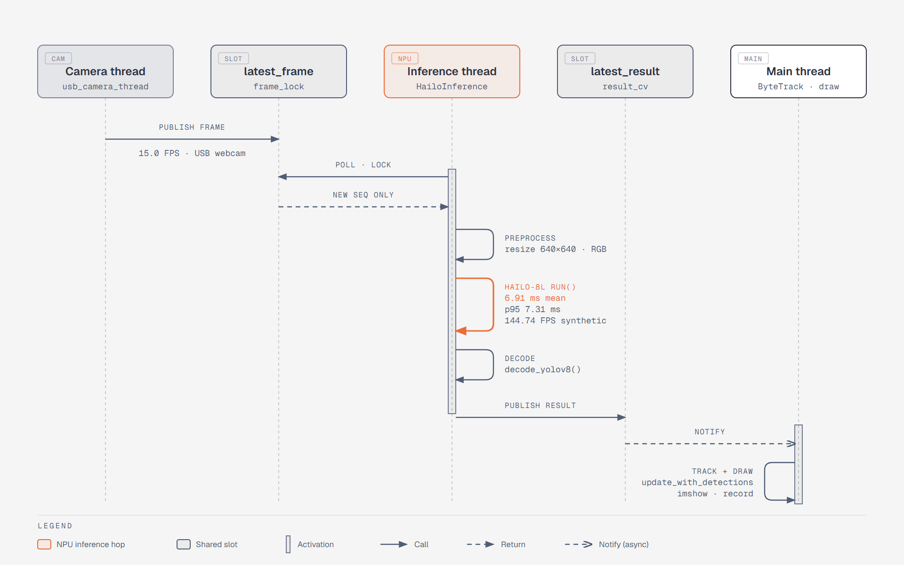
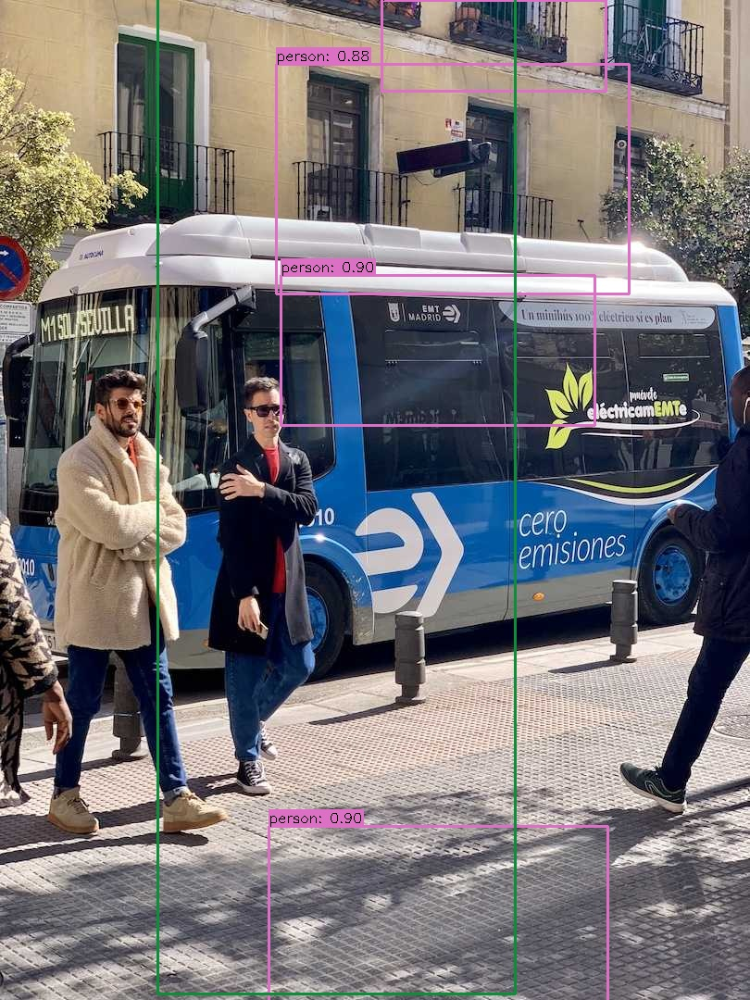

<div align="center">

# yolov8-hailo-pi5

**Real-time YOLOv8 object detection + ByteTrack tracking on a Raspberry Pi 5 with a Hailo-8L NPU.**

[](https://github.com/aaronk2001/yolov8-hailo-pi5/actions/workflows/ci.yml)
[](LICENSE)


-222)



**144.7 FPS** on the NPU · **6.9 ms** mean latency · **~300 lines** of Python

</div>

## Overview

A small, readable Python pipeline that runs YOLOv8n on the Hailo-8L AI HAT+ attached to a
Raspberry Pi 5. Non-max suppression runs on the chip. Detections go through ByteTrack
([`supervision`](https://github.com/roboflow/supervision)), which gives each object an ID that
persists across frames.

- **Live mode:** Pi CSI camera or USB webcam → Hailo-8L → ByteTrack, with optional display and `.mp4` recording.
- **Image mode:** run one image and save an annotated copy.
- **Benchmark:** a reproducible synthetic-frame benchmark that writes a dated Markdown report.

Every number in this README was measured on real hardware. Untested features are listed under
[Limitations](#limitations).

## Hardware

| Part | Tested with |
|---|---|
| Board | Raspberry Pi 5, 16 GB |
| NPU | Hailo-8L AI HAT+ (13 TOPS), PCIe |
| OS | Debian 13.4 (Raspberry Pi OS, Trixie), aarch64 |
| Runtime | HailoRT 4.23.0, Hailo firmware 4.23.0 |
| Camera | UVC USB webcam at 640×480 (CSI path untested) |

## Quickstart

**1. Install the runtime and dependencies**

```bash
sudo apt install python3-hailort            # add python3-picamera2 for a CSI camera
git clone https://github.com/aaronk2001/yolov8-hailo-pi5.git && cd yolov8-hailo-pi5
uv venv --system-site-packages --python /usr/bin/python3 .venv   # system packages expose hailo_platform
source .venv/bin/activate
uv pip install -r requirements.txt
```

**2. Get the model**

The compiled model isn't in the repo. Download the **YOLOv8n HEF for Hailo-8L** (640×640,
on-chip NMS) from the
[Hailo Model Zoo](https://github.com/hailo-ai/hailo_model_zoo/blob/master/docs/public_models/HAILO8L/HAILO8L_object_detection.rst).
Pick the version that matches your HailoRT, then save it as `models/yolov8n.hef`. The file
tested here has this checksum:

```
sha256  7103302bf5f2bac163f60b3f9436684e85f762405749020f89249101bd606f49  models/yolov8n.hef
```

**3. Run it**

Only one process can hold `/dev/hailo0`, so stop any other service using the NPU first.

```bash
# One image -> annotated image
python infer_image.py --image docs/img/bus.jpg --output bus_out.jpg

# Live: auto-picks the CSI camera if present, else /dev/video0
python infer_picamera2.py                                # window, press Q to quit
python infer_picamera2.py --source usb --headless --duration 60 --record out.mp4

# Benchmark the NPU path alone
python benchmarks/run_benchmark.py --label mine --out benchmarks/results-$(date +%F).md
```

<details>
<summary>All options</summary>

| Script | Flag | Default | Meaning |
|---|---|---|---|
| both | `--model` | `models/yolov8n.hef` | HEF to load |
| both | `--conf` | `0.4` | confidence threshold |
| `infer_image.py` | `--image` | required | input image |
| `infer_image.py` | `--output` | `output.jpg` | annotated output |
| `infer_picamera2.py` | `--source` | `auto` | `auto`, `csi`, or `usb` |
| `infer_picamera2.py` | `--device` | `0` | USB webcam index (`/dev/videoN`) |
| `infer_picamera2.py` | `--headless` | off | no display window |
| `infer_picamera2.py` | `--duration` | `0` | stop after N seconds (0 = until Q) |
| `infer_picamera2.py` | `--record` | none | write annotated frames to `.mp4` |

</details>

## How it works

<picture>
  <source media="(prefers-color-scheme: dark)" srcset="docs/diagrams/frame-path-dark.png">
  
</picture>

- [`src/hailo_inference.py`](src/hailo_inference.py) configures the HEF on a `VDevice` and
  opens the pipeline once at startup. After that, `run()` just pushes a frame. `activate()` has
  to be entered before `InferVStreams`: its reader threads start on `__enter__`, and if the
  network group isn't active yet they race and fail with `HAILO_STREAM_NOT_ACTIVATED`.
- An earlier fix for that race re-entered both on every frame. Opening them once raised
  throughput from **80.99 to 144.74 FPS**.
- The inference thread skips frames it has already seen, and ByteTrack is updated once per
  inferred frame. The logged FPS is real throughput, not repeated frames.

## Benchmarks

Measured 2026-09-25 on the hardware above ([full results](benchmarks/results-2026-09-25.md)):

| Frame source | What is timed | FPS | mean ms | p50 ms | p95 ms | p99 ms |
|---|---|---:|---:|---:|---:|---:|
| Synthetic 640×640, 500 frames after 10 warmup | `run()`, activate once (current) | **144.74** | 6.91 | 6.84 | 7.31 | 7.95 |
| Synthetic, same settings | `run()`, activate per frame (old) | 80.99 | 12.35 | 12.06 | 13.10 | 15.47 |
| USB webcam 640×480, 60 s | full pipeline, headless | 15.0 | — | — | — | — |

Each synthetic row is the second of two runs; the first runs gave 144.71 and 80.16 FPS. The
webcam delivered 15 FPS even though it advertises 30, and every frame it delivered was inferred.
**The live pipeline is limited by the camera, not the NPU.**

## Bug found on hardware: swapped box axes

The first run on the Pi drew every box in the wrong place. Hailo's on-chip NMS emits
`[y0, x0, y1, x1]`, and the decoder ([`src/utils/postprocess.py`](src/utils/postprocess.py))
reorders it to `[x0, y0, x1, y1]`. But `draw.py` still unpacked the Hailo order, so every box
came out transposed. Scores and classes were right, which made it look like a model problem at
first. The fix was one line. A regression test now pins it
([`tests/test_draw.py`](tests/test_draw.py)).

| Before (axes swapped) | After (fixed) |
|---|---|
|  |  |

## Project layout

```
infer_image.py          single image -> annotated image
infer_picamera2.py      live pipeline: camera -> Hailo-8L -> ByteTrack (CSI or USB)
src/hailo_inference.py  HailoRT wrapper (configure, activate once, infer)
src/utils/              NMS decoder, box drawing, ByteTrack adapter, COCO labels
benchmarks/             run_benchmark.py and dated results
tests/                  decoder, drawing and tracking tests (no NPU needed)
docs/img/               sample input and outputs
models/                 yolov8n.hef goes here (not committed)
```

## Tests

Everything after the NPU (NMS decoding, drawing, and the ByteTrack hand-off) is plain
NumPy/OpenCV/`supervision`, so it's tested without a Hailo device. That includes the
swapped-axes regression and ByteTrack keeping one ID on a moving object. CI runs `ruff` and
`pytest` on every push.

```bash
uv run --no-project --with numpy --with opencv-python-headless   --with "supervision==0.27.0.post2" --with pytest pytest
```

## Troubleshooting

| Symptom | Check |
|---|---|
| `ModuleNotFoundError: hailo_platform` | The venv must be created with `--system-site-packages`, because HailoRT's Python bindings come from apt. |
| Creating the `VDevice` fails | Another process holds the NPU. Find it with `sudo lsof /dev/hailo0` and stop it. |
| NPU not found at all | `hailortcli fw-control identify` should print the board and firmware version. If it doesn't, reseat the HAT and check the PCIe setup. |
| The HEF won't load | Use a **Hailo-8L** HEF (not Hailo-8) built for your HailoRT version. |
| `--source csi` finds no camera | `rpicam-hello --list-cameras` should list it. Otherwise check the ribbon cable. |

## Limitations

- **Pi CSI camera** (`--source csi`) is implemented but hasn't been run on hardware yet.
- **Tracking quality on a busy scene** hasn't been measured. The 60 s webcam run faced a dark
  scene, so it only measured throughput.
- **Display-window mode** hasn't been run. Only headless mode has.
- **The Hailo path itself** needs the NPU, so CI can't cover it. It's verified by the
  benchmark and image runs above.

## Acknowledgements & license

- [Ultralytics YOLOv8](https://github.com/ultralytics/ultralytics). The model weights are
  **AGPL-3.0** and are not distributed here. Check Ultralytics' license before any commercial use.
- [Hailo Model Zoo](https://github.com/hailo-ai/hailo_model_zoo) and
  [HailoRT](https://github.com/hailo-ai/hailort) for the compiled HEF and runtime.
- [Roboflow `supervision`](https://github.com/roboflow/supervision) for ByteTrack.
- `docs/img/bus.jpg` is the standard Ultralytics sample image.

The code in this repository is MIT licensed. See [LICENSE](LICENSE).
